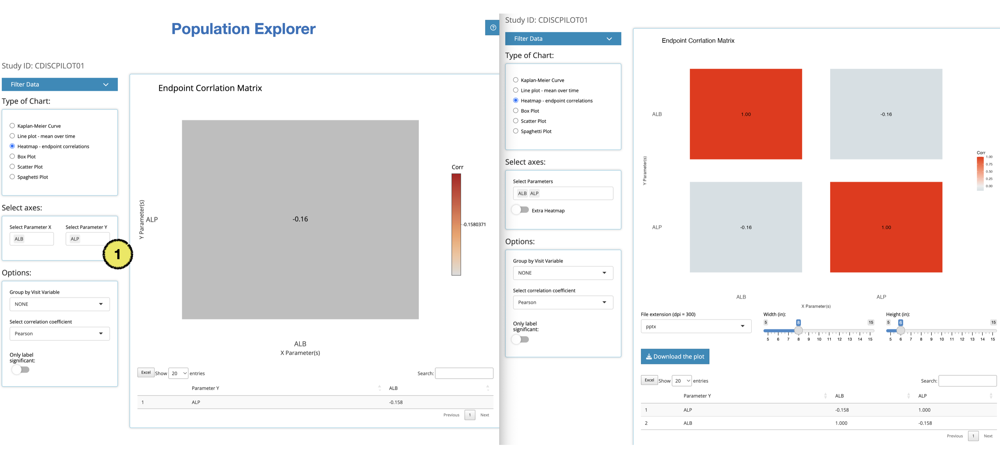

<!-- README.md is generated from README.Rmd. Please edit that file -->

# openCDISC <a href='https://Biogen-Inc.github.io/tidyCDISC/'></a>

`openCDISC` is a shiny app to easily create custom tables and figures
from ADaM-ish data sets.

> This project is based on
> <a href = 'https://github.com/Biogen-Inc/tidyCDISC' target = '_blank'>Biogen’s
> tidyCDISC</a>.

<br>

## Purpose

Goal of **openCDISC** is utilizing **tidyCDISC** additional & customized
function to analysis ADaM-ish data sets without extensive coding work.

<br>

## Install

``` r
# remotes::install_github('zarathucorp/openCDISC')
library(openCDISC)
openCDISC::run_app()
```

## Main difference from tidyCDISC

<br>


**openCDISC** has difference in `Population Explorer` mainly.

### Kaplan-Meier Curve

#### 1. More chart option

Not only `Censored` or `Conficence Interval`, `Table` and `P-value` can
be added in **Kaplan-Meier curve**

If `Table` button selected, it will show result too.


#### 2. Axis tick option

You can select and customize timeline (x axis) from `Day`, `Month` or
`Year`


#### 3. Export chart

You can download result with various filetype for additional work.

Below image is example with `PPT` (`MS Powerpoint` and **ungroup** the
image vectors to customize)


#### 4. Chart direction or type

In `openCDISC` Kaplan-Meier curve uses different direction (using
<a href= 'https://github.com/jinseob2kim/jskm' target = "_blank">
`jskm`</a> package)

In every chart, `tidyCDISC` utilized `Plotly` (as interactive chart).
However in openCDISC, only some of them are use interactive plot while
some chart uses just `ggplot`

below is list of **not interactive chart** - KM - Line plot - Heatmap -
Box Plot

### Line plot

- Difference in only interactive

### Heatmap

#### 1. UI/UX while selecting variable changed.



### Box plot

#### 1. Extra facet feature added.


### Spagetti Plot

#### 1. Extra facet feature added.


